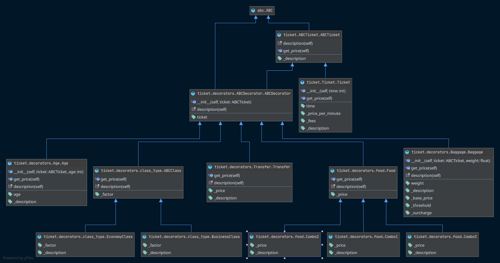

# Air ticket CLI
## Install
### Virtualenv
1. ``$ git clone https://github.com/Irlirion/air_ticket.git``
2. ``$ cd air_ticket``
3. ``$ sudo apt install python3-virtualenv``
4. ``$ virtualenv venv``
5. ``$ . venv/bin/activate``
6. ``$ pip install .``
7. For create ticket by cmd type ``$ ticket``
8. For create ticket by json ``$ read_ticket INPUT_JSON OUTPUT_JSON``
## Example
````
$ ticket
Time of fly: 100
Class (business, economy) [economy]: business
Weight of baggage [0]: 17
Age: 10
Combo type (combo1, combo2, combo3, nothing) [nothing]: combo2
Transfer [False]: 1
Ticket: Business class, weight of baggage: 17, Combo #2, transfer: 1000, age: 10
Price: 7525.0
````
````
$ read_ticket ticket_1.json price.json
Ticket: Business class, weight of baggage: 30, Combo #3, transfer: 1000, age: 10
Price: 4305.0
````
## JSON
````
input.json
{
  "time": 20,
  "cls_type": "business",
  "weight": 30,
  "age": 10,
  "food_type": "combo3",
  "transfer": 1
}

output.json
{"cost": 4305.0}
````
## Help
````
$ ticket --help
Usage: ticket [OPTIONS]

  CLI for creating air ticket.

Options:
  --time INTEGER RANGE           Time of flying in minutes. Default price = 50
                                 rub/min

  --cls_type [business|economy]  Type of ticket. Default factor for Business
                                 class is 1.5

  --weight INTEGER RANGE         Weight of baggage. Weight <= 15 is free. If
                                 the weight > 15 then price + 1000 rub + 100
                                 rub for each kg over 15

  --age INTEGER RANGE            Age of passenger. If the age <= 12, there
                                 will be a 30% discount

  --food_type [1|2|3|nothing]    Type of food. Price: Combo #1: 200 rub, Combo
                                 #2: 300 rub, Combo #3: 400 rub

  --transfer BOOLEAN             Does the passenger need a transfer? Price is
                                 1000 rub

  --help                         Show this message and exit.
````
````
$ read_ticket --help
Usage: read_ticket [OPTIONS] INPUT_JSON OUTPUT_JSON

  Read INPUT_JSON and write ticket cost in OUTPUT_JSON

Options:
  -e, --echo BOOLEAN  Echo price and description to console
  --help              Show this message and exit.
````
### UML ticket
